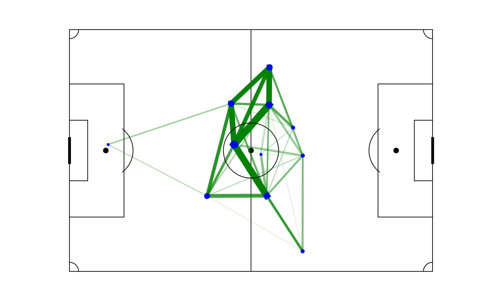
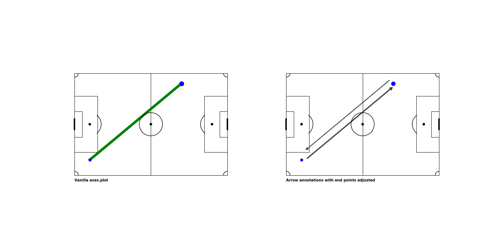
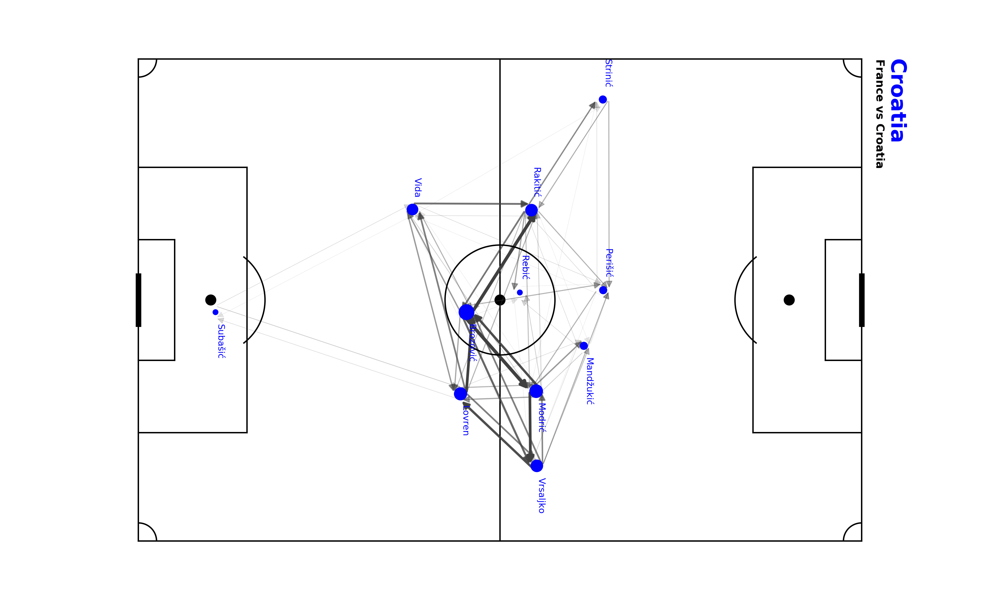

# Creating a Passmap in Python

Passmaps are one of the most popular visualizations in football right now. And for good reason. They pack a lot of useful information
about a single match in an intuitive manner. Passing trends, networks, players' roles in a given system, and even how well they're
performing said roles.

In this post, we'll go through the steps to creating your own in Python using Statsbomb's open data.

(If you're just interested in the code, the github link's [here](https://github.com/sharmaabhishekk/passmaps))

## Pre-requisites

I'm gonna be using Python so you'll need that installed on your system to follow along. If you don't already, you can go over to
[python.org](python.org) and get it for your system.

Other than that, we'll also we using the following Python libraries:

* Matplotlib - for the plotting
* Pandas - wrangling the data
* Requests - making a request to get the data
* Numpy - some more computing on the data


 All of those should be just a `pip install` away!

## Dataset

To create a passmap for a match, we'll need some event data. Statsbomb have you covered with their excellent free [data](https://github.com/statsbomb/open-data). If you don't
have a local copy of the data, don't worry - that's what the requests library was for.

## Basic Overview


What really is a passmap?


This is the popular version by @[11tegen11](https://twitter.com/11tegen11). At first glance, it might seem like there's a lot going on here (and that kinda threw me off a bit the first time I saw these in the wild) but
let's take a closer look at what information it's supposed to convey to us.

The two most important things of note are - the ***average position of the player***,
and the ***number of passes*** between any two given players.

Apart from that, we also have the **players' names**, and the players' dot sizes (which indicate the **total number of
passes played by the player**).
Finally we have some aesthetic details - the watermark, team's logo, match details.
For the purpose of this post, we are going to ignore the watermark and the logo of the team.

## Getting Started


### Imports

 ```python

import json
import pandas as pd
import matplotlib.pyplot as plt
import requests
from pandas import json_normalize
import numpy as np
from pitch import Pitch ##a helper function to quickly give us a pitch
import warnings

from pandas.core.common import SettingWithCopyWarning
warnings.simplefilter(action="ignore", category=SettingWithCopyWarning)

 ```

Statsbomb has a unique `match_id` for every match in the open-data repository. The match we're going to look at is the FIFA WC 2018 Final
between France and Croatia. The id for it is **"8658"** and let's look at **Croatia** to start with (which was the away side in the match).
Let's set some variables to that data and also grab our figure and axis instances from matplotlib.

```python

match_id = "8658"
side = "away"
color = "blue"
min_pass_count = 2 ##minimum number of passes for a link to be plotted

fig, ax = plt.subplots()
ax = Pitch(ax)

```

The next step would be to write a Class called `Player`. Why do that? Well, if you think about it, a player is basically an object
with certain **attributes** - name, a unique player_id, and on whom we can run some **methods** -
like calculate the total number of passes attempted completed, or their average position on the pitch. That's pretty much the
textbook definition of an object!

```python

class Player:
    def __init__(self, player, df):
        self.id = player["player"]["id"]
        self.name = player["player"]["name"]
        self.average_position(df)

    def average_position(self, df):

        player_pass_df = df.query("(type_name == 'Pass') & (pass_type_name not in ['Free Kick', 'Corner', 'Throw-in', 'Kick Off']) & (player_id == @self.id) & (pass_outcome_name not in ['Unknown','Out','Pass Offside','Injury Clearance', 'Incomplete'])")
        self.x, self.y = np.mean(player_pass_df['location'].tolist(), axis=0)

        self.n_passes_completed = len(player_pass_df)

```

## Loading the data

We can either load the data from the Github [repository](https://github.com/statsbomb/open-data) online or from your local copy of it. Let's write a function to
take care of both cases. We're going to tell the function which match (**match_id**), and how to get the data (**remote/local**). It's gonna return
the data (which is going to be in JSON format) and also the data formatted to a Pandas dataframe.

```python

def load_file(match_id, getter="remote", path = None):
    """ """

    if getter == "local":
        with open(f"{path}/{match_id}.json", "r", encoding="utf-8") as f:
            match_dict = json.load(f)
            df = json_normalize(match_dict, sep="_")
            df = df.query("location == location")
            df[['x','y']] = pd.DataFrame(df.location.values.tolist(), index= df.index)
            df['y'] = 80 - df['y'] ##Reversing the y-axis co-ordinates because Statsbomb use this weird co-ordinate system
            df['location'] = df[['x', 'y']].apply(list, axis=1)

        return match_dict, df

    elif getter == "remote":
        resp = requests.get(f"https://raw.githubusercontent.com/statsbomb/open-data/master/data/events/{match_id}.json")

        match_dict = json.loads(resp.text)
        df = json_normalize(match_dict, sep="_")
        df = df.query("location == location")
        df[['x','y']] = pd.DataFrame(df.location.values.tolist(), index= df.index)
        df['y'] = 80 - df['y'] ##Reversing the y-axis co-ordinates because Statsbomb use this weird co-ordinate system
        df['location'] = df[['x', 'y']].apply(list, axis=1)

        return match_dict, df

```

I know for a fact that every match JSON file contains the lineups for both teams as the first two dictionaries in our list.
Let's go ahead and look at it ourselves.

```python
print(match_dict[0])

"""{'id': '47638847-fd43-4656-b49c-cff64e5cfc0a', 'index': 1, 'period': 1, 'timestamp': '00:00:00.000', 'minute': 0,
 'second': 0, 'type': {'id': 35, 'name': 'Starting XI'}, 'possession': 1,'possession_team': {'id': 771, 'name': 'France'},
 'play_pattern': {'id': 1, 'name': 'Regular Play'}, 'team': {'id': 771, 'name': 'France'}, 'duration': 0.0,
  'tactics': {'formation': 442, 'lineup':
  [{'player': {'id': 3099, 'name': 'Hugo Lloris'}, 'position': {'id': 1, 'name': 'Goalkeeper'}, 'jersey_number': 1},
  {'player': {'id': 5476, 'name': 'Benjamin Pavard'}, 'position': {'id': 2, 'name': 'Right Back'}, 'jersey_number': 2},
  {'player': {'id': 5485, 'name': 'Raphaël Varane'}, 'position': {'id': 3, 'name': 'Right Center Back'}, 'jersey_number': 4},
  {'player': {'id': 5492, 'name': 'Samuel Yves Umtiti'}, 'position': {'id': 5, 'name': 'Left Center Back'}, 'jersey_number': 5},
   {'player': {'id': 5484, 'name': 'Lucas Hernández Pi'}, 'position': {'id': 6, 'name': 'Left Back'}, 'jersey_number': 21},
   {'player': {'id': 20004, 'name': 'Paul Pogba'}, 'position': {'id': 9, 'name': 'Right Defensive Midfield'}, 'jersey_number': 6},
   {'player': {'id': 3961, 'name': 'N"Golo Kanté'}, 'position': {'id': 11, 'name': 'Left Defensive Midfield'}, 'jersey_number': 13},
   {'player': {'id': 3009, 'name': 'Kylian Mbappé Lottin'}, 'position': {'id': 12, 'name': 'Right Midfield'}, 'jersey_number': 10},
   {'player': {'id': 4375, 'name': 'Blaise Matuidi'}, 'position': {'id': 16, 'name': 'Left Midfield'}, 'jersey_number': 14},
   {'player': {'id': 5487, 'name': 'Antoine Griezmann'}, 'position': {'id': 22, 'name': 'Right Center Forward'}, 'jersey_number': 7},
   {'player': {'id': 3604, 'name': 'Olivier Giroud'}, 'position': {'id': 24, 'name': 'Left Center Forward'}, 'jersey_number': 9}]}}"""
```

This is important because we need the **names**, and **ids** of the players who started the match. So let's go ahead
and write a small function to get all that data from the dictionary.

```python

def get_starters(match_dict, side="home"):
    """ """
    lineups = match_dict[0]["tactics"]["lineup"] if side == "home" else match_dict[1]["tactics"]["lineup"]
    return lineups

```

We're almost set with all the functions and classes we're gonna need to define. Now, we're going to need to call them. But before that,
we're quickly going to pull the names of both the teams in a dictionary. That's gonna be helpful later when we're adding text to
the viz.

```python
side_dict = {"home": match_dict[0]["team"]["name"],
             "away": match_dict[1]["team"]["name"] }

print(side_dict)

## {'home': 'France', 'away': 'Croatia'}
```

Let's go ahead and call our functions to get the data and the lineups.

```python
match_dict, df = load_file(match_id, getter="remote")
lineups = get_starters(match_dict, side=side)

```
Now we are going to create `Player` objects out of all the players in our lineups list and put them all together in a dictionary.

```python
player_objs_dict = {}
starters = []
for player in lineups:
    starters.append(player["player"]["name"]) ##To remove all substitutes from our final grouped_df
    p = Player(player, df) ##Calling the Player class
    player_objs_dict.update({player["player"]["name"]: p}) ##For lookup during plotting the grouped_df

```
## Data-cleaning

Now we clean up the events dataframe a little.
The first step is to get only the events which are **only open-play passes and only passes by the side we've chosen, and only those that are successful.**
We chain all these filters together using the query method.

The next part is to group these passes together based on the player who passed the ball and the one who received the ball.
For example, if Modric passed to Brozovic four times in the entire match, we are gonna have four separate rows in `total_pass_df`
for it. But when we apply the groupby method, that's compressed into a single row with the new column count reflecting the value four.

The final step is to get only the players who were in the starters list and the minimum passes played between them is greater
than or equal to a certain value - I'm gonna go with 2. This is initialised right at the beginning :point_up: .

```python
total_pass_df = df.query(f"(type_name == 'Pass') & (pass_type_name not in ['Free Kick', 'Corner', 'Throw-in', 'Kick Off']) &"\
                                 f"(team_name == '{side_dict[side]}') & (pass_outcome_name not in ['Unknown','Out','Pass Offside','Injury Clearance', 'Incomplete'])")
total_pass_df = total_pass_df.groupby(["player_name", "pass_recipient_name"]).size().reset_index(name="count")
total_pass_df = total_pass_df.query(" (player_name == @starters) & (pass_recipient_name == @starters) & (count>=@min_pass_count) ")
```

Here's our final dataframe -

```python

print(total_pass_df)

#     player_name pass_recipient_name  count
#      Ante Rebić        Ivan Perišić      2
#      Ante Rebić       Šime Vrsaljko      2
# Danijel Subašić        Dejan Lovren      4
# Danijel Subašić        Domagoj Vida      3
#    Dejan Lovren     Danijel Subašić      3

```

## Visualization

So far so good. Now's the time to visualise our results. We're going to iterate over our dataframe, grab the players who did the
passing and receiving, grab the player_object of those two players from our `player_objs` dictionary and then grab their names,
average positions, and their total passes.

You could go ahead and plot them right now using `ax.plot` and they'd look like this.



There's room for some improvement though. We are not able to tell, **between Player A and Player B, who passed more to whom**.
If Modric passes to Brozovic ten times in a match and Brozovic only returns the favour
once, that information is lost to us because there's just one thick line between both of them.
For this reason, it might make sense to use arrows to denote direction but also make sure they're not overlapping.

To do that, we use some if-else logic. We pick up a unique identifier for the players - the `player_id` will do just fine.
Then we can compare the `player_id` - if `player_id` of Player A is greater than Player B, shift the arrow from A to B a little to
the left. If B is greater than A, shift the arrow a little to the right. Basically, as seen in the figure below -




**Note**: *We can also apply the same logic to players who are on the same line horizontally - the only difference would be that instead of
shifting the arrow left and right, we'll shift them a little up and a little down.*


```python
arrow_shift = 1 ##Units by which the arrow moves from its original position
shrink_val = 1.5 ##Units by which the arrow is shortened from the end_points

##Visualising the passmap

for row in total_pass_df.itertuples():

    link = row[3] ## for the arrow-width and the alpha
    passer = player_objs_dict[row[1]]
    receiver = player_objs_dict[row[2]]

    alpha = link/15
    if alpha >1:
        alpha=1

    if abs( receiver.x - passer.x) > abs(receiver.y - passer.y):

        if receiver.id > passer.id:
            ax.annotate("", xy=(receiver.x, receiver.y + arrow_shift), xytext=(passer.x, passer.y + arrow_shift),
                            arrowprops=dict(arrowstyle="-|>", color="0.25", shrinkA=shrink_val, shrinkB=shrink_val, lw = link*0.12, alpha=alpha))

        elif passer.id > receiver.id:
            ax.annotate("", xy=(receiver.x, receiver.y - arrow_shift), xytext=(passer.x, passer.y - arrow_shift),
                            arrowprops=dict(arrowstyle="-|>", color="0.25", shrinkA=shrink_val, shrinkB=shrink_val, lw=link*0.12, alpha=alpha))

    elif abs(receiver.x - passer.x) <= abs(receiver.y - passer.y):

        if receiver.id > passer.id:
            ax.annotate("", xy=(receiver.x + arrow_shift, receiver.y), xytext=(passer.x + arrow_shift, passer.y),
                            arrowprops=dict(arrowstyle="-|>", color="0.25", shrinkA=shrink_val, shrinkB=shrink_val, lw=link*0.12, alpha=alpha))

        elif passer.id > receiver.id:
            ax.annotate("", xy=(receiver.x - arrow_shift, receiver.y), xytext=(passer.x - arrow_shift, passer.y),
                            arrowprops=dict(arrowstyle="-|>", color="0.25", shrinkA=shrink_val, shrinkB=shrink_val, lw=link*0.12, alpha=alpha))


```
The final step of our visualisation is to add scatter points to the players' locations and also annotate them with their last names.
We can then add some extra heading and sub-heading information. Here's our final result after all that's taken care of.

```python
for name, player in player_objs_dict.items():

    ax.scatter(player.x, player.y, s=player.n_passes_completed*1.3, color=color, zorder = 4)
    ax.text(player.x, player.y+2 if player.y >40 else player.y -2, s=player.name.split(" ")[-1], rotation=270, va="top" if player.y<40 else "bottom", size=6.5, fontweight="book", zorder=7, color=color)

ax.text(124, 80, f"{side_dict[side]}", size=12, fontweight="demibold", rotation=270, color=color, va="top")
ax.text(122, 80, f"{side_dict['home']} vs {side_dict['away']}", size=8, fontweight="demibold", rotation = 270, va="top")

fig.tight_layout()
```



Pretty neat, huh? There's still room for a lot of improvements/experimenting. We could try some network analysis on the dataframe
and find out the centrality measures - like betweenness centrality to find out the most important player(s).
Passmaps also have a few limitations: the affinity for average position may lead to pretty wildly inaccurate results when players change positions a lot
in a given match.

I hope this was a fruitful/fun python exercise. For any sort of feedback, feel free to reach out to me on Twitter!

__________________________

**Note**: *Since I first published this post, I realized I had made a stupid error initially. I hadn't noticed that
Statsbomb use the reversed co-ordinate system for the y-axis. Hence all players of the right ended up on the left and vice-versa.
Full credit to [Soumyajit Bose](https://twitter.com/MessiBose) for catching that. I've fixed the code to take care of that.*


